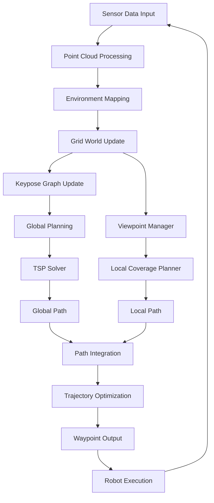
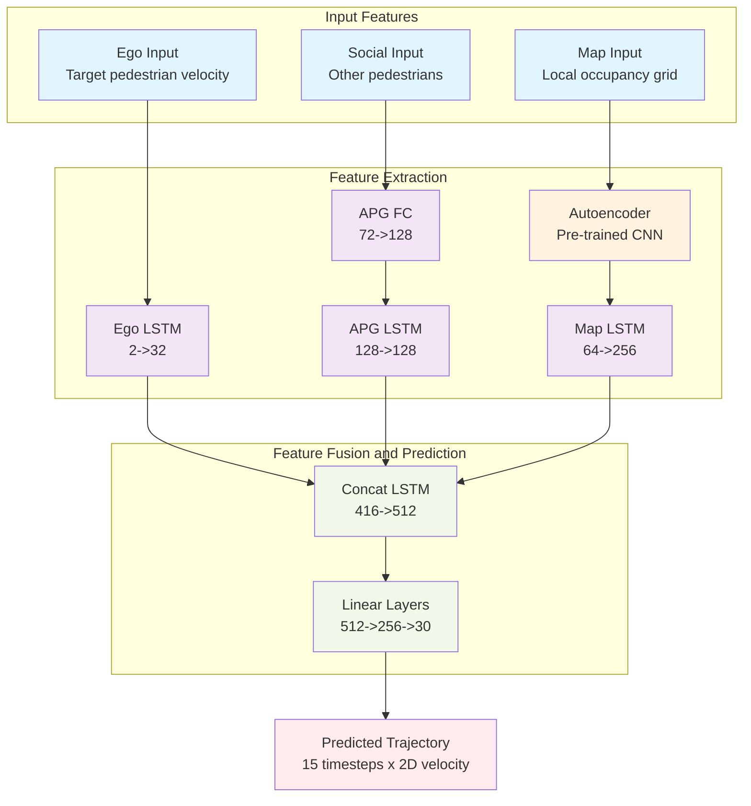

# DPHP Planner

DPHP is a robotic exploration planning system that combines global and local path planning strategies for efficient environment exploration. This system is designed for autonomous robots operating in unknown environments, using sensor data to build maps and plan optimal exploration paths.

## Table of Contents
- [Overview](#overview)
- [System Architecture](#system-architecture)
  - [Explorer Package Structure](#explorer-package-structure)
- [Program Flow](#program-flow)
- [Core Algorithms](#core-algorithms)
  - [1. Grid World Representation](#1-grid-world-representation)
  - [2. Keypose Graph](#2-keypose-graph)
  - [3. Viewpoint Management](#3-viewpoint-management)
  - [4. TSP Solver](#4-tsp-solver)
  - [5. Dual Path Planning](#5-dual-path-planning)
- [Predictor Module](#predictor-module)
  - [Network Architecture](#network-architecture)
  - [Training Strategy](#training-strategy)
  - [Input Features](#input-features)
  - [Output](#output)
- [Key Components](#key-components)
  - [SensorCoveragePlanner3D](#sensorcoverageplanner3d)
  - [GridWorld](#gridworld)
  - [ViewPointManager](#viewpointmanager)
  - [KeyposeGraph](#keyposegraph)
  - [TSPSolver](#tspsolver)
- [Dependencies](#dependencies)
- [Usage](#usage)
- [Parameters](#parameters)
- [Contributing](#contributing)
- [License](#license)

## Overview

The DPHP Planner implements a dual-path hybrid approach for robotic exploration:
- **Global Path Planning**: Uses a grid-based world representation with TSP (Traveling Salesman Problem) optimization for long-term exploration planning
- **Local Path Planning**: Employs viewpoint-based coverage planning for short-term navigation and sensor coverage optimization

## System Architecture

The system consists of three main packages:

1. **explorer**: Core exploration planning implementation
2. **predictor**: Pedestrian trajectory prediction module using LSTM-based neural networks
3. **visualization_tools**: Visualization components for debugging and monitoring

### Explorer Package Structure

```
explorer/
├── include/
│   ├── sensor_coverage_planner/
│   ├── grid_world/
│   ├── viewpoint_manager/
│   ├── keypose_graph/
│   ├── tsp_solver/
│   ├── local_coverage_planner/
│   └── ... (other components)
├── src/
│   ├── explorer_node/
│   ├── sensor_coverage_planner/
│   ├── grid_world/
│   ├── viewpoint_manager/
│   ├── keypose_graph/
│   ├── tsp_solver/
│   └── ... (other components)
└── ...
```

## Program Flow



## Core Algorithms

### 1. Grid World Representation

The system uses a 3D grid world to represent the environment:

- Each **cell** has a status: UNSEEN, EXPLORING, COVERED, NOGO, etc.
- Cells maintain connections to viewpoints and keypose graph nodes
- Efficient spatial indexing for fast lookup and planning

### 2. Keypose Graph

A sparse graph structure that represents the global structure of explored areas:

- **Nodes**: Keypose positions and connectivity points
- **Edges**: Valid connections between nodes considering collision constraints
- Used for global path planning and navigation

### 3. Viewpoint Management

Local planning is based on viewpoints within the robot's planning horizon:

- Viewpoints are sampled in the local planning space
- Each viewpoint is evaluated for:
  - Collision constraints
  - Line-of-sight visibility
  - Coverage contribution
  - Connectivity to existing paths

### 4. TSP Solver

For global path optimization, the system uses Google's OR-Tools:

- Formulates exploration sequence as a Traveling Salesman Problem
- Optimizes the order of visiting grid cells for maximum efficiency
- Considers distance metrics and coverage priorities

### 5. Hierarchical Path Planning

The core innovation of DPHP is its dual-path approach:

1. **Global Path**: Long-term plan using grid world and TSP optimization
2. **Local Path**: Short-term coverage-based plan using viewpoint sampling

These paths are integrated to produce a smooth, executable trajectory.

## Predictor Module

The predictor module implements a pedestrian trajectory prediction system using LSTM-based neural networks. It is designed to predict the future trajectories of pedestrians in the environment, which can be used for safer robot navigation.

### Network Architecture



The predictor network consists of several specialized components:

1. **Ego LSTM**: Processes the target pedestrian's velocity information (2D input -> 32D hidden state)

2. **Social Processing**:
   - APG FC Layer: Converts Angular Pedestrian Grid representation (72 bins) to dense features (72 -> 128)
   - APG LSTM: Processes temporal information of other pedestrians (128 -> 128)

3. **Map Processing**:
   - Pre-trained Autoencoder: Encodes local occupancy grids using a CNN architecture
   - Map LSTM: Processes temporal map information (64 -> 256)

4. **Feature Fusion**:
   - Concat LSTM: Combines all features (32+128+256 = 416 -> 512)

5. **Prediction Head**:
   - Linear Layers: Final prediction layers (512 -> 256 -> 30) to predict 15 future timesteps with 2D velocity each

### Training Strategy

The predictor uses several advanced training techniques:

1. **EWC (Elastic Weight Consolidation)**: Prevents catastrophic forgetting when training on new datasets
2. **Coreset Maintenance**: Keeps a representative set of examples from previous tasks
3. **Multi-task Learning**: Can learn from multiple datasets while preserving knowledge from previous ones
4. **Coordinate Rotation**: Rotates the scene based on pedestrian heading for better generalization

### Input Features

1. **Ego Input**: Target pedestrian's velocity (2D)
2. **Social Input**: Other pedestrians represented as Angular Pedestrian Grid (72 bins)
3. **Map Input**: Local occupancy grid processed through a pre-trained autoencoder

### Output

Predicted trajectory for the next 15 timesteps (3 seconds at 5Hz) as 2D velocity vectors.

## Key Components

### SensorCoveragePlanner3D
Main exploration planner class that coordinates all components:
- Processes sensor input (LiDAR point clouds)
- Maintains environment representations
- Executes planning cycles
- Manages exploration state

### GridWorld
3D grid-based environment representation:
- Tracks cell states (unseen, covered, etc.)
- Manages cell connectivity
- Interfaces with viewpoint manager

### ViewPointManager
Manages local planning viewpoints:
- Samples and evaluates viewpoints
- Performs collision checking
- Calculates coverage contributions

### KeyposeGraph
Global structure representation:
- Maintains sparse graph of key positions
- Provides global connectivity information
- Supports efficient path finding

### TSPSolver
Global path optimization:
- Uses OR-Tools for solving TSP
- Optimizes cell visiting sequence
- Considers multiple objectives

## Dependencies

- ROS (Robot Operating System)
- PCL (Point Cloud Library)
- Eigen3
- OpenCV
- Google OR-Tools
- GNU Scientific Library (GSL)
- PyTorch (for predictor module)

## Usage

To run the DPHP planner:

```bash
# Build the project
catkin_make

# Source the workspace
source devel/setup.bash

# Launch the explorer node
rosrun explorer explorer_node
```

## Parameters

Key parameters can be configured in the launch files:
- Sensor range and FOV settings
- Grid resolution and size
- Planning horizon dimensions
- Collision checking thresholds
- Coverage evaluation parameters

## Contributing


## License

This project is licensed under the TODO license - see the LICENSE file for details.