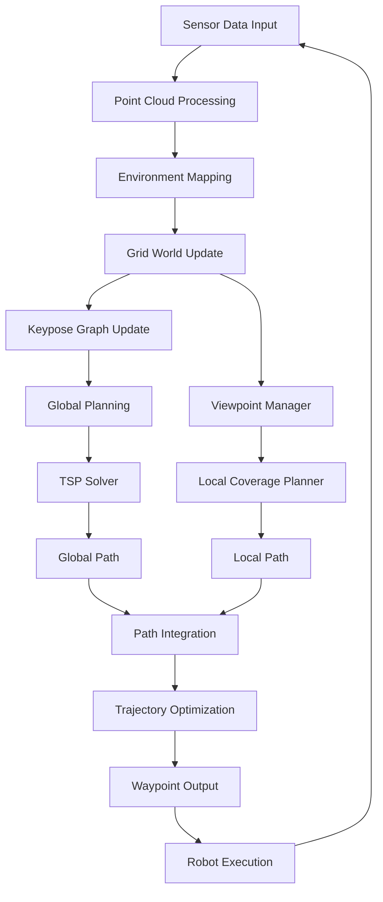

# DPHP Planner (Dual Path Hybrid Planner)

DPHP is a robotic exploration planning system that combines global and local path planning strategies for efficient environment exploration. This system is designed for autonomous robots operating in unknown environments, using sensor data to build maps and plan optimal exploration paths.

## Overview

The DPHP Planner implements a dual-path hybrid approach for robotic exploration:
- **Global Path Planning**: Uses a grid-based world representation with TSP (Traveling Salesman Problem) optimization for long-term exploration planning
- **Local Path Planning**: Employs viewpoint-based coverage planning for short-term navigation and sensor coverage optimization

## System Architecture

The system consists of three main packages:

1. **explorer**: Core exploration planning implementation
2. **predictor**: (Description needed - appears to be for prediction functionality)
3. **visualization_tools**: Visualization components for debugging and monitoring

### Explorer Package Structure

```
explorer/
├── include/
│   ├── sensor_coverage_planner/
│   ├── grid_world/
│   ├── viewpoint_manager/
│   ├── keypose_graph/
│   ├── tsp_solver/
│   ├── local_coverage_planner/
│   └── ... (other components)
├── src/
│   ├── explorer_node/
│   ├── sensor_coverage_planner/
│   ├── grid_world/
│   ├── viewpoint_manager/
│   ├── keypose_graph/
│   ├── tsp_solver/
│   └── ... (other components)
└── ...
```

## Program Flow



## Core Algorithms

### 1. Grid World Representation

The system uses a 3D grid world to represent the environment:

- Each **cell** has a status: UNSEEN, EXPLORING, COVERED, NOGO, etc.
- Cells maintain connections to viewpoints and keypose graph nodes
- Efficient spatial indexing for fast lookup and planning

### 2. Keypose Graph

A sparse graph structure that represents the global structure of explored areas:

- **Nodes**: Keypose positions and connectivity points
- **Edges**: Valid connections between nodes considering collision constraints
- Used for global path planning and navigation

### 3. Viewpoint Management

Local planning is based on viewpoints within the robot's planning horizon:

- Viewpoints are sampled in the local planning space
- Each viewpoint is evaluated for:
  - Collision constraints
  - Line-of-sight visibility
  - Coverage contribution
  - Connectivity to existing paths

### 4. TSP Solver

For global path optimization, the system uses Google's OR-Tools:

- Formulates exploration sequence as a Traveling Salesman Problem
- Optimizes the order of visiting grid cells for maximum efficiency
- Considers distance metrics and coverage priorities

### 5. Dual Path Planning

The core innovation of DPHP is its dual-path approach:

1. **Global Path**: Long-term plan using grid world and TSP optimization
2. **Local Path**: Short-term coverage-based plan using viewpoint sampling

These paths are integrated to produce a smooth, executable trajectory.

## Key Components

### SensorCoveragePlanner3D
Main exploration planner class that coordinates all components:
- Processes sensor input (LiDAR point clouds)
- Maintains environment representations
- Executes planning cycles
- Manages exploration state

### GridWorld
3D grid-based environment representation:
- Tracks cell states (unseen, covered, etc.)
- Manages cell connectivity
- Interfaces with viewpoint manager

### ViewPointManager
Manages local planning viewpoints:
- Samples and evaluates viewpoints
- Performs collision checking
- Calculates coverage contributions

### KeyposeGraph
Global structure representation:
- Maintains sparse graph of key positions
- Provides global connectivity information
- Supports efficient path finding

### TSPSolver
Global path optimization:
- Uses OR-Tools for solving TSP
- Optimizes cell visiting sequence
- Considers multiple objectives

## Dependencies

- ROS (Robot Operating System)
- PCL (Point Cloud Library)
- Eigen3
- OpenCV
- Google OR-Tools
- GNU Scientific Library (GSL)

## Usage

To run the DPHP planner:

```bash
# Build the project
catkin_make

# Source the workspace
source devel/setup.bash

# Launch the explorer node
rosrun explorer explorer_node
```

## Parameters

Key parameters can be configured in the launch files:
- Sensor range and FOV settings
- Grid resolution and size
- Planning horizon dimensions
- Collision checking thresholds
- Coverage evaluation parameters

## Contributing

This project is maintained by Joosoo at BUCT (joosoo@buct.edu.cn). Contributions are welcome through standard GitHub workflows.

## License

This project is licensed under the TODO license - see the LICENSE file for details.